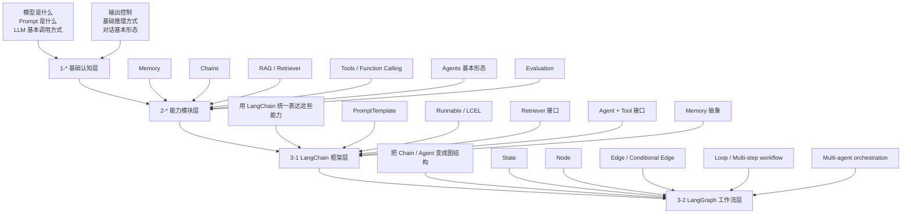
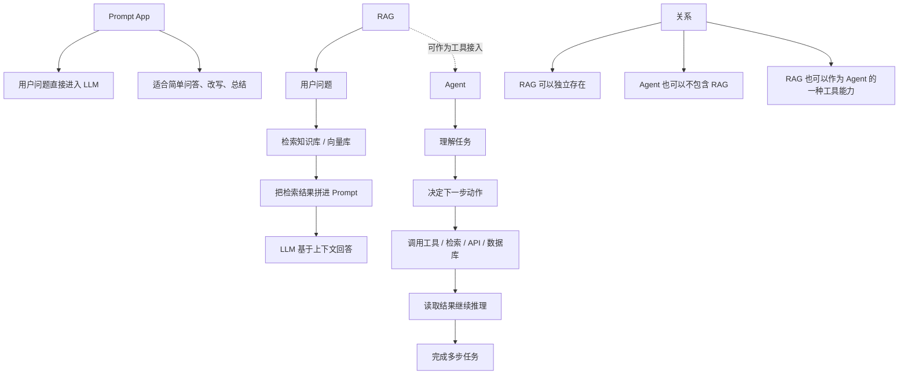
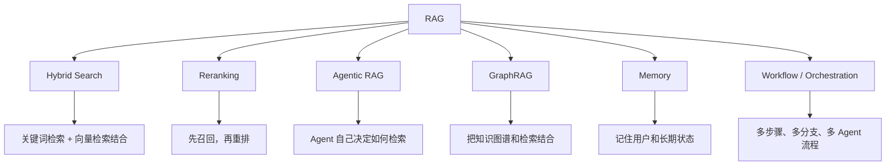

# AI Agent Knowledge Progression Map

这张图用来说明本项目里 `1-*`、`2-*`、`3-1`、`3-2` 之间的知识递进关系。

## 一句话理解

- `1-*`：学基础概念
- `2-*`：学单项能力模块
- `3-1`：学怎么用 LangChain 把这些能力框架化
- `3-2`：学怎么用 LangGraph 把 Agent 系统工作流化

## 推荐打开方式

- `VS Code`：直接打开 `.md` 文件，然后用 Markdown Preview 看图
- `Typora`：打开后通常能直接渲染 Mermaid
- `Obsidian`：开启 Mermaid 支持后可直接显示
- `GitHub` / 支持 Mermaid 的 Markdown 查看器：也可以直接渲染

如果只是普通文本编辑器打开，也能看到 Mermaid 源码，只是不会自动渲染成图。

## Prompt App / RAG / Agent 关系图

这张图用来区分三个容易混在一起的概念：

- `Prompt App`：直接问模型
- `RAG`：先检索知识，再让模型回答
- `Agent`：模型能做决策、调用工具、分步骤执行任务

## 怎么理解它们的关系

- `Prompt App`：最简单，只是“Prompt + LLM”
- `RAG`：重点是“拿知识”
- `Agent`：重点是“做决策、调工具、跑步骤”

所以更准确的关系是：

- `RAG` 不是 `Agent` 的同义词
- `Agent` 不一定自带 `RAG`
- 在真实系统里，`RAG` 经常只是 `Agent` 可调用的一种能力

## RAG 相关热门技术图

这张图表示的是：除了基础 `RAG` 之外，现在常见的热门方向主要是在它周围做增强、编排或扩展。

## 每个技术的作用

### 1. RAG

最基础的模式是：

1. 用户提问
2. 去知识库检索相关内容
3. 把检索结果拼进 Prompt
4. 模型基于上下文回答

它解决的核心问题是：
- 让模型不只依赖训练时知识
- 让回答可以基于你自己的文档、数据库、知识库

### 2. Hybrid Search

这是现在非常常见的 RAG 增强方式。

它的思路是：
- 不只做向量检索
- 同时结合关键词检索、全文检索、BM25 等方法

为什么热门：
- 纯向量检索有时语义相近但关键词不准
- 纯关键词检索有时字面匹配强但语义理解弱
- 混合检索通常能把召回质量拉高

一句话理解：
- `Hybrid Search` 解决的是“怎么把文档找得更全、更准”

### 3. Reranking

它通常出现在检索之后。

流程通常是：

1. 先粗召回很多候选文档
2. 再用专门的 reranker 模型重新排序
3. 只把最相关的少量文档送给 LLM

为什么热门：
- 很多 RAG 系统不是“查不到”，而是“查到了但排序不好”
- rerank 往往比单纯调大 `top_k` 更有效

一句话理解：
- `Reranking` 解决的是“怎么把最该给模型看的文档排到前面”

### 4. Agentic RAG

这是近两年非常热门的方向。

它和普通 RAG 的区别是：
- 普通 RAG：通常检索一次就回答
- Agentic RAG：让 agent 自己决定下一步怎么查

典型流程可能是：

1. 判断要不要检索
2. 改写 query
3. 查一个或多个知识源
4. 判断结果够不够
5. 不够就继续查
6. 最后再回答

为什么热门：
- 更像真实人类查资料的过程
- 面对复杂问题时，比“一次检索 + 一次回答”更稳

一句话理解：
- `Agentic RAG` 解决的是“怎么把检索过程做成会思考的系统”

### 5. GraphRAG

这是现在讨论度很高的另一个方向。

它的特点是：
- 不只依赖文本块相似度
- 还利用实体、关系、知识图谱结构

适合的场景：
- 关系密集型知识
- 组织架构、人物关系、事件关系、产业链关系
- 单纯向量检索不容易抓住“谁和谁有什么关系”的问题

为什么热门：
- 传统 RAG 更擅长“找相似段落”
- GraphRAG 更擅长“找关系网络”

一句话理解：
- `GraphRAG` 解决的是“怎么把知识之间的关系也纳入检索”

### 6. Memory

Memory 和 RAG 很像，但重点不一样。

区别大致是：
- `RAG`：查外部知识
- `Memory`：记住用户、偏好、上下文、长期状态

典型记忆内容包括：
- 用户喜欢什么
- 之前做过什么任务
- 当前项目处于什么阶段
- 过去几轮推理得出的中间结论

为什么热门：
- 长期助手、个性化 agent、持续任务系统都很需要它

一句话理解：
- `Memory` 解决的是“系统怎么记住你，而不是每次都重新开始”

### 7. Workflow / Orchestration

这类技术不只是“查知识”，而是组织整个系统怎么跑。

比如：
- 先分类问题
- 再选择检索策略
- 再判断是否需要工具
- 再进行评分、重试、分支、循环
- 甚至多个 agent 协作

为什么热门：
- 真实系统很少只有一步
- 当系统变复杂时，工作流编排比单一链式调用更重要

一句话理解：
- `Workflow` 解决的是“复杂 AI 系统怎么分步骤可靠运行”

## 这些技术之间怎么选

- 如果你刚开始：先学 `RAG`
- 如果你发现“召回效果一般”：看 `Hybrid Search + Reranking`
- 如果你发现“一次检索不够复杂任务用”：看 `Agentic RAG`
- 如果你要处理强关系型知识：看 `GraphRAG`
- 如果你要做长期助手：看 `Memory`
- 如果你要做复杂系统：看 `Workflow / Orchestration`

## 项目里这些技术讲到多深

这一部分专门回答一个更实际的问题：

- `code` 目录里的 `1-*`、`2-*` 确实覆盖了哪些技术？
- 这些技术是“知道有这个词”而已，还是已经讲到核心机制？

先给一个结论：

- `1-*` 主要还是基础概念课，几乎不系统展开这些高级模式
- 这些技术主要集中在 `2-*`
- 其中深度最好的几类是：
  - `Reranking`
  - `Agentic RAG`
  - `Workflow / Orchestration`
- `GraphRAG` 基本没有专门展开

## 技术覆盖深度总表

| 技术 | 在 `1-* / 2-*` 是否有 | 主要目录 | 深度判断 | 一句话结论 |
|---|---|---|---|---|
| `Hybrid Search` | 有 | `2-1-RetrievalAugmentedGeneration` | 基础演示 | 知道是什么、见过怎么用，但没有深入优化策略 |
| `Reranking` | 有，而且比较明显 | `2-1`、`2-2` | 讲到核心机制 | 已经理解“先召回、再重排”的关键思想 |
| `Agentic RAG` | 有 | `2-4-Building Agentic RAG with Llamaindex` | 讲到核心机制 | 已经进入“agent 决定怎么检索”的核心范式 |
| `GraphRAG` | 基本没有 | 无明确课程实现 | 基本没讲 | 目前这批课程没有系统覆盖 |
| `Memory` | 有 | `2-3-ai-agents-for-beginners` | 基础到中层 | 已讲用途和基本实现，但没进入高级 memory architecture |
| `Workflow / Orchestration` | 有，而且很多 | `2-3`、`2-4` | 讲到核心机制 | 已经覆盖多种编排模式，不只是概念介绍 |

## 1. Hybrid Search

### 在哪里出现

最明显的是：

- [Vector_Database.ipynb](/Users/a1-6/Desktop/AIAgent/code/2-1-RetrievalAugmentedGeneration/Vector_Database.ipynb)

里面直接出现了：

- `articles.query.hybrid(...)`

这说明课程已经让你接触到“混合检索”这个概念，而不是只会纯向量检索。

### 它讲到了什么

你已经能从课程里得到这些认知：

- 检索不一定只能靠 embedding
- 关键词检索和向量检索可以结合
- 混合检索在很多场景里比单一路径更稳

这对入门已经很重要，因为它能帮你打破一个常见误区：

- 误区：RAG = 只做向量检索

实际上在真实系统里，很多检索层本来就是混合的。

### 它还没讲到什么

从目前项目内容看，还没有系统深入这些更核心的话题：

- dense / sparse 分数怎么融合
- hybrid 的权重如何调优
- 不同 query 类型下，关键词和向量各自的优劣
- hybrid 检索的离线评测指标
- 召回率与精确率之间如何平衡

### 深度判断

这一块更像：

- `基础演示`
- `概念建立`
- `初步使用`

而不是“深入掌握 hybrid retrieval engineering”。

### 一句话总结

- `Hybrid Search` 在你项目里是“知道是什么、见过怎么调用”，但还没有展开到核心调参和评测层。

## 2. Reranking

### 在哪里出现

这部分在你的代码里非常明显，主要集中在：

- [Rag.ipynb](/Users/a1-6/Desktop/AIAgent/code/2-1-RetrievalAugmentedGeneration/module1/Rag.ipynb)
- [L1-Advanced_RAG_Pipeline.ipynb](/Users/a1-6/Desktop/AIAgent/code/2-2-BuildingAndEvaluatingAdvancedRAGApplications/L1/L1-Advanced_RAG_Pipeline.ipynb)
- [L3-Sentence_window_retrieval.ipynb](/Users/a1-6/Desktop/AIAgent/code/2-2-BuildingAndEvaluatingAdvancedRAGApplications/L3/L3-Sentence_window_retrieval.ipynb)
- [L4-Auto-merging_Retrieval.ipynb](/Users/a1-6/Desktop/AIAgent/code/2-2-BuildingAndEvaluatingAdvancedRAGApplications/L4/L4-Auto-merging_Retrieval.ipynb)

以及对应的工具代码里，反复出现：

- `SentenceTransformerRerank`
- `bge-reranker-base`

### 它讲到了什么

这部分已经不是“听说过 rerank”而已，而是已经让你接触到 reranking 的核心工作机制：

1. 第一阶段先召回一批候选文档
2. 第二阶段用更强的 reranker 再判断相关性
3. 只保留最相关的少量结果给 LLM

而且你项目里不是孤立地提这个概念，而是把它放进了完整检索链里：

- sentence window retrieval
- auto-merging retrieval
- postprocessor pipeline

所以你看到的不只是“rerank 是什么”，而是：

- rerank 在系统里放在哪一层
- 为什么不能只靠第一轮向量召回
- rerank 怎么和别的检索增强组件配合

### 它已经讲到的核心本质

这一点非常关键：

- 第一轮检索负责“广召回”
- 第二轮 rerank 负责“精排序”

这就是 reranking 最重要的工程思想。

只要你把这一点真正理解了，你已经不是“只知道名词”。

### 它还没讲到什么

当前项目里还没明显系统展开这些更深层工程问题：

- cross-encoder 与 bi-encoder 的系统级对比
- rerank 带来的时延成本怎么权衡
- 不同 top_k / top_n 的最优区间
- 在线 A/B 实验怎么验证 rerank 是否真的提升
- rerank 失败案例如何分析

### 深度判断

这一块我会判断为：

- `已经讲到核心机制`
- `不是工业深水区`
- `但已经相当扎实`

### 一句话总结

- `Reranking` 是你当前课程体系里讲得比较到位的一类，已经不只是皮毛。

## 3. Agentic RAG

### 在哪里出现

主要集中在：

- [2-4-Building Agentic RAG with Llamaindex](/Users/a1-6/Desktop/AIAgent/code/2-4-Building%20Agentic%20RAG%20with%20Llamaindex)

尤其是：

- [L2_Tool_Calling.ipynb](/Users/a1-6/Desktop/AIAgent/code/2-4-Building%20Agentic%20RAG%20with%20Llamaindex/Lesson_2/L2_Tool_Calling.ipynb)
- [L3_Building_an_Agent_Reasoning_Loop.ipynb](/Users/a1-6/Desktop/AIAgent/code/2-4-Building%20Agentic%20RAG%20with%20Llamaindex/Lesson_3/L3_Building_an_Agent_Reasoning_Loop.ipynb)
- [L4_Building_a_Multi-Document_Agent.ipynb](/Users/a1-6/Desktop/AIAgent/code/2-4-Building%20Agentic%20RAG%20with%20Llamaindex/Lesson_4/L4_Building_a_Multi-Document_Agent.ipynb)

### 它讲到了什么

这里已经明显超出“普通 RAG”了，因为它不只是：

- 问题 -> 检索 -> 回答

而是开始进入：

- 检索被包装成工具
- agent 自己决定要不要调用检索工具
- agent 可以决定先查哪个工具
- agent 可以根据中间结果继续下一步
- agent 可以跨多个文档或多个知识源工作

这正是 `Agentic RAG` 的核心范式。

### 它已经讲到的核心本质

这一块你已经在学的，不是名词，而是下面这些本质问题：

- 检索是不是 agent 决策的一部分
- 检索是不是可以多轮发生
- 检索结果是否影响下一步工具选择
- 知识获取过程是不是动态而不是固定死的

这些都是 `Agentic RAG` 最核心的东西。

### 它还没完全展开的部分

如果继续往更深的工程方向走，还会碰到：

- query planning
- retrieval critique
- self-reflection
- adaptive retry
- 多工具选择策略
- agentic RAG 的系统评测框架

这些在你现在的课程里还没有系统展开到那个深度。

### 深度判断

这一块我会判断为：

- `已经讲到核心机制`
- `已经不是皮毛`
- `但离完整工程体系还有一步`

### 一句话总结

- `2-4` 已经让你真正接触到 Agentic RAG 的核心思路，而不只是“把 RAG 起了个新名字”。

## 4. GraphRAG

### 在哪里出现

从你当前 `1-*` 和 `2-*` 的代码、notebook、说明文档里看：

- 没有看到明确的 `GraphRAG` 实现
- 没有看到系统讲知识图谱式检索流程
- 也没有看到典型的图谱构建 + 图检索 + 图上下文注入链路

### 这意味着什么

说明你现在这批课程虽然已经覆盖了：

- 传统 RAG
- 高级 RAG
- Agentic RAG
- Workflow

但还没有系统进入：

- 图结构知识建模
- 实体关系检索
- graph traversal
- graph-aware context building

### 深度判断

- `基本没讲`

### 一句话总结

- `GraphRAG` 是你当前课程体系里的空白项，如果后面要补，这会是一个新主题，不是已有内容的简单重复。

## 5. Memory

### 在哪里出现

主要在：

- [13-agent-memory.ipynb](/Users/a1-6/Desktop/AIAgent/code/2-3-ai-agents-for-beginners/13-agent-memory/13-agent-memory.ipynb)
- [13-agent-memory-chromadb.ipynb](/Users/a1-6/Desktop/AIAgent/code/2-3-ai-agents-for-beginners/13-agent-memory/13-agent-memory-chromadb.ipynb)
- [12-chat_summarization.ipynb](/Users/a1-6/Desktop/AIAgent/code/2-3-ai-agents-for-beginners/12-context-engineering/12-chat_summarization.ipynb)

### 它讲到了什么

这一部分已经让你理解：

- 为什么 agent 需要 memory
- memory 和简单拼聊天历史不是一回事
- memory 可以向量化存储
- memory 可以按语义检索回来
- memory 能被 agent 用于个性化回答

这已经不是“知道有个 memory”而已，而是开始接触它的使用方式和基本架构。

### 它已经讲到的核心本质

你其实已经接触到 Memory 的几个关键问题：

- 存什么
- 什么时候存
- 怎么存
- 什么时候取
- 取回来怎么给 agent 用

这些就是 memory 系统最基础也最重要的问题。

### 它还没深入到什么程度

再往前走，会遇到更复杂的话题：

- semantic memory / episodic memory / procedural memory 的分层
- 记忆冲突怎么处理
- 记忆是否衰减、遗忘
- 记忆写入策略怎么优化
- 如何评估 memory 的收益与污染

这些目前在课程里还没系统展开。

### 深度判断

这一块大致是：

- `基础到中层`
- `讲到了核心用途和基本实现`
- `还没进入高级 memory architecture`

### 一句话总结

- `Memory` 在你项目里不是皮毛，但目前更偏“实用入门 + 基本机制”，还没到高级系统设计层。

## 6. Workflow / Orchestration

### 在哪里出现

这一块是你项目里覆盖最系统的之一，主要在两大块：

第一块：

- [14-microsoft-agent-framework](/Users/a1-6/Desktop/AIAgent/code/2-3-ai-agents-for-beginners/14-microsoft-agent-framework)

第二块：

- [2-4-Building Agentic RAG with Llamaindex](/Users/a1-6/Desktop/AIAgent/code/2-4-Building%20Agentic%20RAG%20with%20Llamaindex)

尤其是：

- `sequential`
- `concurrent`
- `conditional workflow`
- `handoff`
- `human loop`
- `middleware`
- `FunctionAgent`
- `Context`
- workflow event stream

### 它讲到了什么

这已经不是“workflow 是什么”这种介绍，而是把常见编排模式拆开讲了。

你已经接触到的关键模式包括：

- 串行执行
- 并发执行
- 条件分支
- agent handoff
- human-in-the-loop
- middleware 拦截
- context / state 传递

这已经非常接近工作流编排的核心骨架了。

### 它已经讲到的核心本质

你课程里这部分最有价值的地方在于，它已经让你理解：

- agent 系统不是只有“问一次答一次”
- 真正复杂系统需要图式结构和状态流转
- 一个 agent 的输出会成为另一个节点的输入
- 整个系统需要分支、暂停、继续、人工介入

这些就是 orchestration 的核心。

### 它还没完全进入的深水区

更往工程深处走，还会涉及：

- durable workflow
- crash recovery
- checkpoint / resume
- distributed orchestration
- tracing / observability
- fault tolerance

这些在你的课程里还没有完全展开成生产级系统主题。

### 深度判断

这一块我会判断为：

- `已经讲到核心机制`
- `覆盖面很系统`
- `超出皮毛很多`

### 一句话总结

- `Workflow / Orchestration` 是你当前项目里讲得最完整的一批高级主题之一。

## 最终结论

如果把深度分成四档：

1. 只知道名词  
2. 基础演示  
3. 讲到核心机制  
4. 接近工程深水区

那么你当前 `1-*`、`2-*` 里的这些技术，大致可以这样归类：

- `Hybrid Search`：`2. 基础演示`
- `Reranking`：`3. 讲到核心机制`
- `Agentic RAG`：`3. 讲到核心机制`
- `GraphRAG`：`基本没讲`
- `Memory`：`2 和 3 之间`
- `Workflow / Orchestration`：`3. 讲到核心机制`

一句话收尾：

- 你的 `2-*` 并不是只讲皮毛
- 真正讲得比较扎实的是：
  - `Reranking`
  - `Agentic RAG`
  - `Workflow / Orchestration`
- 相对浅一点的是：
  - `Hybrid Search`
  - `Memory`
- `GraphRAG` 基本还没有进入当前课程体系
